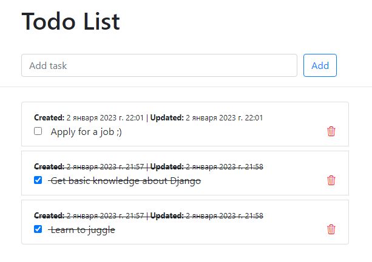
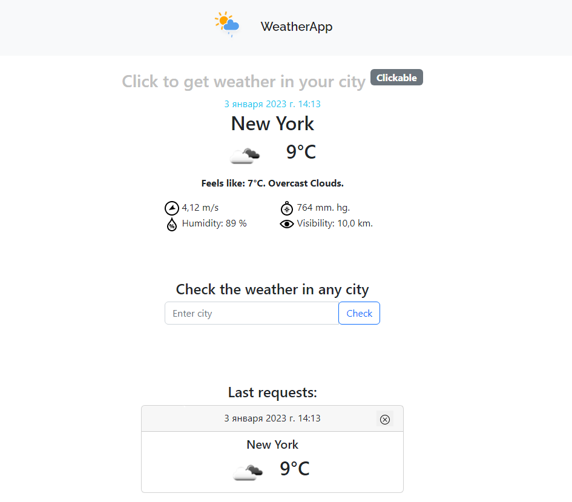

# django-project-overone

## Introduction

This is my Django Project ✍ written during IT Overone course. 
I got acquainted with the architecture of the Django Framework 🌐:
- learned how to bind routes to corresponding views 🔀;
- used either CBV (Class-based views) or FBV (Function-based views) 📋;
- got basic knowledge of working with SQL queries 🗃️;
- created models that describe the logical structure of an object, its behavior, 
and the way its parts are represented to us 📚;
- worked with templates (Jinja2, Django Template Language), created custom template tags 📄;
- learned how to manage static files and serve files uploaded by a user 📂;
- used and configured admin-panel 🦸;
- used a Form class that describes a form and determines how it works and appears ⌨️;
- gained an understanding of pagination 📖;
- acquired knowledge of user authentication in Django 🔐.

This project consists of 3 applications:
- [Blog](#blog)
- [ToDo](#todo)
- [WeatherApp](weather_app)


## Blog
The application available at `http://127.0.0.1:8000/blog/`

Blog is a full-featured blog web app, that can do CRUD operations.
Developed using Django Web Framework with features such as:
- View posts written by community 👨‍👩‍👦
- Write, update, delete your own posts ✔
- Registration and authorization
- Comment on any post (access only for authenticated users 🗝️) 
- View, Update your profile 💇, upload Profile Picture 🤳
- View the latest 🆕 and most commented posts 🔥
- Filter posts by tags 🔍


## ToDo
The application available at `http://127.0.0.1:8000/todo/`

A simple todo application build with Django




## Weather
The application available at `http://127.0.0.1:8000/weather/`

This is an application for helping users to check weather. You can check weather in any city all over the world.
Also, by using you geolocation, you can get weather in your city, without sending any request. 
To make it available I use OpenWeatherMap API.




## Installation guide
1. Clone git repository
2. Install a Virtual Environment
3. Install the dependencies
```
python pip install -r requirements.txt
```
4. Make and apply migrations:
```
python manage.py makemigrations
```
```
python manage.py migrate
```
5. Create superuser:
```
python manage.py createsuperuser
```
6. To provide initial data for Blog models run in terminal:
```
python manage.py loaddata blog_posts.json
```
7. Run the server:
```
python manage.py runserver
```


